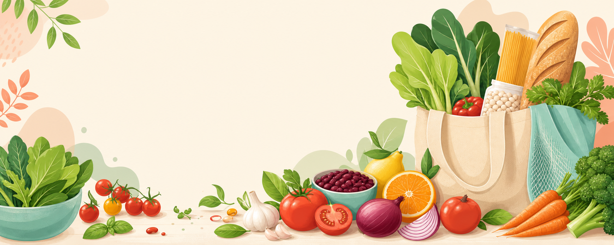
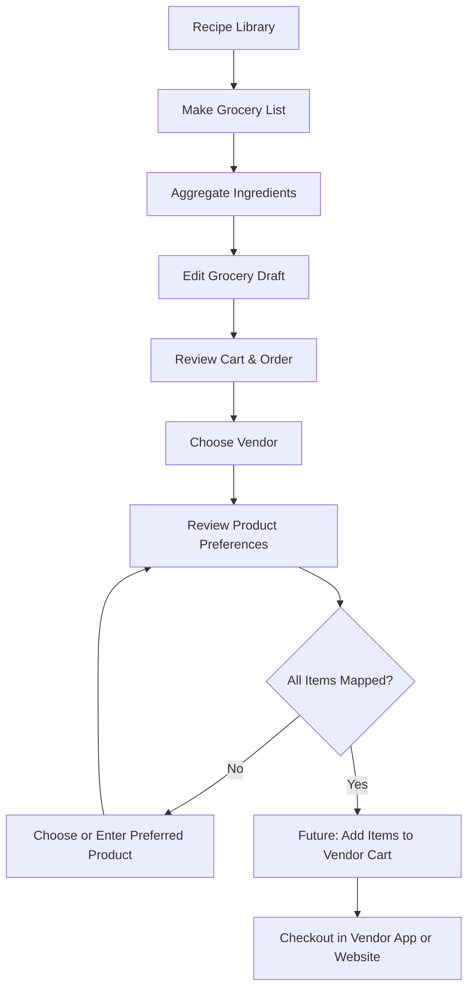

# GroceryGetter

GroceryGetter is a recipe planning and grocery cart preparation tool. Recipes are stored as data, selected into a meal plan, aggregated into a grocery list, mapped to preferred store products, and eventually sent to a grocery retailer cart.

Created by [AJ Brown](https://github.com/ansleybrown1337).



The current implementation is a local Streamlit app backed by SQLite. Kroger is the first planned vendor integration, and live cart writes are intentionally disabled in the UI until OAuth and product matching are completed.

> [!IMPORTANT]
> This project is not affiliated with, endorsed by, or associated with Kroger. The Kroger API and trademarks belong to their respective owners.

## Current Status

Working now:

- SQLite schema for recipes, ingredients, recipe steps, and product mappings.
- Seed recipe library with five starter recipes in `data/seed_recipes.json`.
- Ingredient aggregation across multiple selected recipes.
- Basic unit normalization for common volume, mass, and count units.
- Streamlit UI for selecting recipes, editing grocery drafts, guided recipe entry, reviewing carts, and saving product preferences.
- Tests for persistence, aggregation, product mapping, and Kroger payload creation.

Not live yet:

- OAuth callback handling in the Streamlit app.
- Vendor product search UI.
- Real add-to-cart calls from the UI.
- Package-size math, leftovers tracking, and substitution preferences.

## Workflow


```mermaid
flowchart TD
    A["Recipe Library"] --> B["Make Grocery List"]
    B --> C["Aggregate Ingredients"]
    C --> D["Edit Grocery Draft"]
    D --> E["Review Cart & Order"]
    E --> F["Choose Vendor"]
    F --> G["Review Product Preferences"]
    G --> H{"All Items Mapped?"}
    H -- "No" --> I["Choose or Enter Preferred Product"]
    I --> G
    H -- "Yes" --> J["Future: Add Items to Vendor Cart"]
    J --> K["Checkout in Vendor App or Website"]
```

## Project Structure

```text
app.py                         Streamlit app entrypoint
data/schema.sql                SQLite schema
data/seed_recipes.json         Starter recipes committed as source data
src/grocerygetter/database.py  Database initialization and seed loading
src/grocerygetter/repository.py SQLite repository methods
src/grocerygetter/meal_planner.py Ingredient aggregation logic
src/grocerygetter/kroger.py    Kroger API adapter and cart payload builder
src/grocerygetter/models.py    Dataclasses for core app concepts
src/grocerygetter/units.py     Unit normalization helpers
tests/                         Unit tests
```

## Setup

Create an environment and install dependencies:

```bash
pip install -r requirements.txt
```

Or with conda:

```bash
conda env create -f environment.yml
conda activate grocerygetter
```

Copy `.env.example` to `.env` when you are ready to work on Kroger credentials:

```bash
cp .env.example .env
```

The app uses `data/grocerygetter.sqlite` by default. That file is generated locally from `data/schema.sql` and `data/seed_recipes.json`; it is not meant to be edited by hand or committed.

## Run The App

```bash
streamlit run app.py
```

The first run creates the SQLite database and loads seed recipes if the recipe table is empty.

## Run Tests

```bash
python -m unittest discover -s tests
```

If your system Python is not on PATH, use the Python executable from your environment.

## Data Model

Recipes are stored as rows, not classes. That keeps the data portable and makes it easier to build a website, mobile API, or multi-user backend later.

Core tables:

- `recipes`: recipe metadata such as name, servings, source, and notes.
- `recipe_ingredients`: structured ingredient rows with name, quantity, unit, and preparation.
- `recipe_steps`: ordered cooking instructions.
- `product_mappings`: saved preferences from normalized grocery items to store products/UPCs.

Seed recipes live in JSON so the repo stays readable in git. SQLite is generated from that source data.

## Vendor Integration Notes

The app separates recipe planning from vendor API calls. This is intentional:

- Product and location lookup can be developed without touching cart writes.
- Cart writes usually require a shopper-authorized token.
- The grocery list should be reviewed before anything is sent to an external cart.
- Saved UPC mappings should be reusable so repeated weekly shopping gets faster.

The target flow is:

1. Build a grocery list from selected recipes.
2. Remove pantry items and adjust grocery quantities.
3. Choose a vendor for cart review.
4. Search vendor products for each grocery item.
5. Let the user choose the best product.
6. Save the UPC/product mapping.
7. Build a reviewed cart payload.
8. Add items to the vendor cart.
9. Finish checkout in the vendor app or website.

## Development Plan

1. Finish core recipe management: edit/delete recipes, import/export seed data, and better ingredient parsing.
2. Promote common ingredients into a dedicated ingredient catalog if fuzzy matching is not enough.
3. Build Kroger OAuth into the app.
4. Add location-aware Kroger product search.
5. Save chosen product mappings per ingredient, location, and modality.
6. Convert ingredient quantities into package counts where possible.
7. Enable live add-to-cart after review.
8. Later: migrate the same domain layer behind a proper web API and responsive frontend.

## License

This project is licensed under the GNU GPL v2.0 License. See `LICENSE` for details.
