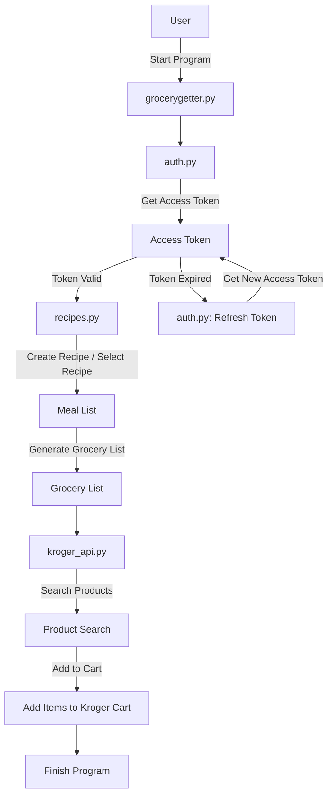

# Custom Recipe and Grocery List Generator (grocerygetter)
Created by: <br/>
[AJ Brown](https://sites.google.com/view/ansleyjbrown)<br/>

> [!NOTE]
> This project is a work in progress and is not functional yet. Please check back later for updates.

Banner image here:

*Figure generated using DALL-E from OpenAI*

> [!IMPORTANT]
> **Disclaimer:** This project is not affiliated with, endorsed by, or associated with Kroger. The use of Kroger's API and/or logo is solely for the purpose of integrating with their publicly available services. All trademarks and logos belong to their respective owners.


This Python-based tool allows users to create custom recipes with ingredients and quantities, add selected recipes to their meal list, and generate a grocery list based on the meal list. The grocery list can then be used to make a call to the Kroger API to add the items directly to the user's cart for easy purchase.

This came as a result of my wife and I trying to make grocery lists every week. This process was slow because we'd make a list in apple notes, then find these items one-by-one in the kroger app, and place an order for pickup. This tool is designed to streamline that process by allowing us to create recipes, add them to a meal list, and generate a grocery list that can be sent directly to the Kroger API to add items to our cart. This way, we can make a grocery list in a fraction of the time it used to take.

## Table of Contents

- [Features](#features)
- [Installation](#installation)
- [Usage](#usage)
- [Example Workflow](#example-workflow)
- [API Information](#api-information)
- [Contributions](#contributions)
- [License](#license)
- [Contact](#contact)

## Features

- **Custom Recipe Creation:** Users can input ingredients and their quantities to create custom recipes.
- **Meal List Generation:** Select recipes to add to a personalized meal list.
- **Grocery List:** Automatically generates a grocery list from the meal list.
- **Kroger API Integration:** Adds items from the grocery list to the user's Kroger shopping cart.

## Installation
1. Clone the repository:
```bash
git clone https://github.com/ansleybrown1337/grocerygetter.git
```
2. Install the required packages:
```bash
pip install -r requirements.txt
```
3. set up your Kroger API credentials by following the instructions in the [Kroger API documentation](https://developer.kroger.com/documentation)

## Usage

1. Run the script to create your custom recipes and generate a grocery list:
   ```bash
   python grocerygetter.py
   ```

2. Follow the prompts to:
- Create new recipes by specifying ingredients and quantities.
- Select recipes for your meal list.
- Generate a grocery list and send it to the Kroger API to populate your Kroger cart.

## Workflow

### User Workflow
1. **Create Recipes:** Add your custom recipes with ingredients.
2. **Generate Meal List:** Select recipes to add to your meal plan.
3. **Create Grocery List:** A shopping list is automatically created from the selected recipes.
4. **API Call:** The items from the grocery list are added to your Kroger cart.


### Code Workflow


## API Information

This tool uses the [Kroger API](https://developer.kroger.com/) to add items from the grocery list to the user's Kroger shopping cart. Make sure to register for an API key and add your credentials in the `.env` file as shown in the example below:

```bash
KROGER_API_KEY = your_api_key 
KROGER_API_SECRET = your_api_secret
```


To load these variables in your Python script, use the `python-dotenv` library as follows:

```python
from dotenv import load_dotenv
import os

# Load environment variables from the .env file
load_dotenv()

# Access variables
kroger_api_key = os.getenv('KROGER_API_KEY')
kroger_api_secret = os.getenv('KROGER_API_SECRET')
```

## Contributions

Contributions are welcome! Please submit a pull request or open an issue for any feature requests or bug reports. We encourage collaboration and improvements to the tool.

## License

This project is licensed under the GNU GPL v2.o License. See the `LICENSE` file for more information.

### Disclaimer
This tool is an open-source project and is provided as-is, without any warranties or guarantees. The developer (AJ Brown) is not responsible for any issues or damages resulting from the use of this tool. By using this tool, you agree to hold the developer harmless from any liability.

## Contact

Developed by **AJ Brown**. You can reach me at: [ansleybrown1337@gmail.com](mailto:ansleybrown1337@gmail.com).

---
**Note:** This project is not affiliated with Kroger. It uses their public API for grocery list automation.
